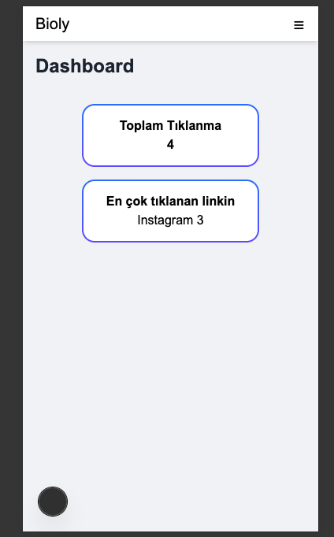
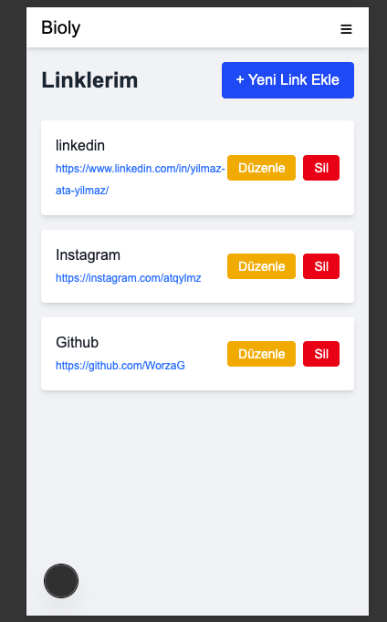
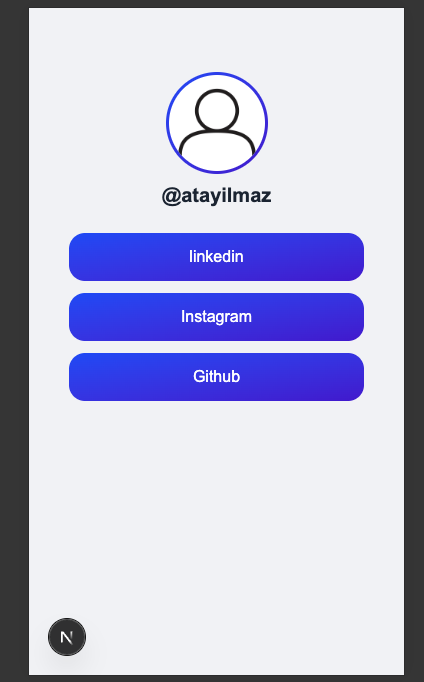

# 📘 Bioly

**Bioly**, kullanıcıların bağlantılarını kolayca yönetebileceği, modern ve güvenli bir link paylaşım platformudur. Kullanıcılar kendi profillerini oluşturabilir, bağlantılarını düzenleyebilir ve tıklanma istatistiklerini takip edebilir. Proje, güçlü bir backend mimarisi ve dinamik bir frontend yapısıyla geliştirilmiştir.

---

## 🚀 Özellikler

- 🧑‍💻 **Kullanıcı Dashboard**
  - Link ekleme, silme ve güncelleme işlemleri
  - Tıklanma istatistiklerinin görüntülenmesi

- 🔐 **Kimlik Doğrulama Sistemi**
  - Login ve Register işlemleri
  - JWT tabanlı güvenli oturum yönetimi

- 🔗 **Akıllı Yönlendirme Sistemi**
  - Her kullanıcıya özel `username` ile link oluşturma
  - Otomatik yönlendirme ve tıklama takibi

- 🌍 **Public Profil Sayfası**
  - Kullanıcının herkese açık bağlantı listesi
  - Estetik ve responsive tasarım

---

## 🧰 Kullanılan Teknolojiler

### 🔙 Backend

| Teknoloji      | Açıklama                                      |
|----------------|-----------------------------------------------|
| Node.js        | Sunucu tarafı uygulama geliştirme             |
| PostgreSQL     | Güçlü ve güvenilir ilişkisel veritabanı       |
| JWT Web Token  | Güvenli kullanıcı kimlik doğrulama sistemi    |
| MVC Mimarisi   | Kodun modüler ve sürdürülebilir yapıda olması |

### 🖥️ Frontend

| Teknoloji       | Açıklama                                         |
|-----------------|--------------------------------------------------|
| Next.js         | React tabanlı sunucu tarafı render desteği       |
| Redux Toolkit   | State yönetimi, API bağlantıları ve auth sistemi |
| Tailwind CSS    | Hızlı ve modern stil oluşturma sistemi           |

---

## 📁 Proje Yapısı

```plaintext
bioly/
├── server/
|   ├── middlewares/
|   ├── db/
│   ├── controllers/
│   ├── models/
│   ├── routes/
│   └── server.js
├── client/
│   ├── src/
│     ├── app/
│   ├── lib/    
│     ├──redux/    
│      
└── README.md

```
## 📷 Ekran Görüntüleri

### Landing Page 


### Kullanıcı Dashboard


### Link Yönetimi


### Public Profil Sayfası



